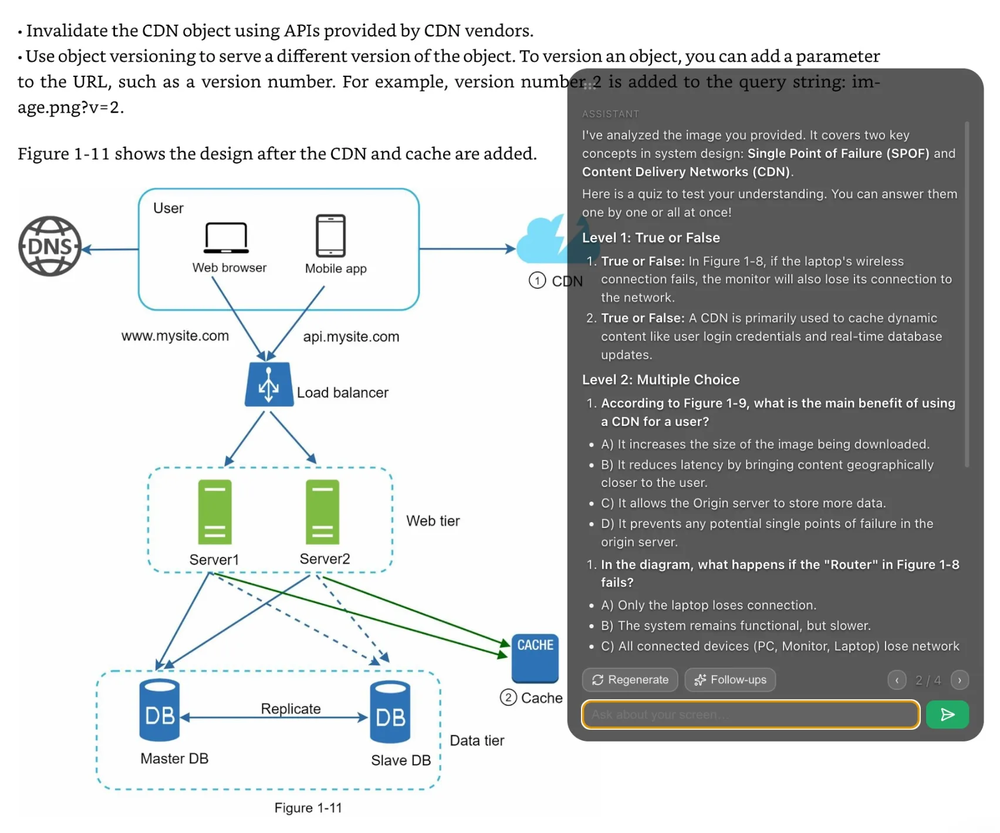

<div align="center">
  
  <h1>Corujinha</h1>
  <p><strong>Um companheiro de IA que mora num canto da sua tela, enxerga o que você está fazendo e te ajuda. <br/> Local, privado e gratuito.</strong></p>
</div>

---

<div align="center">
  
  <br />
  <em>Ex.: A Corujinha lê o que está na tela e monta um quiz sobre o conteúdo.</em>
</div>

## O que é

Corujinha é um app de macOS que vive numa pílula flutuante no topo da tela (estilo Dynamic Island). Você **mostra algo na tela e pergunta**, ele tira um print, manda pro seu modelo de IA rodando **localmente no Ollama** e responde no contexto do que está ali na sua frente.

Nasceu pra estudo, mas serve como um assistente genérico do dia a dia: explicar, traduzir, resumir, criar quiz, guiar um passo a passo, escrever, dar ideias, montar um mapa mental, sempre olhando junto com você.

## Como funciona

```
Você pergunta  →  Corujinha vê o print + responde
```

Por padrão, cada pergunta captura a tela na hora e envia (texto + imagem) para o Ollama via API compatível com OpenAI (`/v1/chat/completions`). Você pode **recortar só um pedaço** da tela (`⌘⇧2`) ou **desligar o envio do print** e perguntar só por texto. Nada sai da sua máquina.

## Recursos

- 🦉 **Notch flutuante** — pílula que expande em painel; arrastar, redimensionar, ajustar opacidade, sempre no topo
- 👁️ **Vê a sua tela** — captura contextual a cada pergunta, com visão do modelo
- ✂️ **Recorte de área** (`⌘⇧2`) — selecione um pedaço da tela e envie só ele; ideal pra **texto pequeno**, que o modelo lê muito melhor num recorte do que na tela inteira
- 🖥️ **Enviar tela on/off** — um toggle ao lado do campo de texto decide se cada pergunta anexa o print da tela ou vai só como texto
- 🔒 **Local e privado** — roda 100% no seu Ollama; escondido de gravação/captura de tela (content protection)
- 💬 **Q&A com histórico** — paginação de respostas, regenerar, sugestões de perguntas de continuidade
- 🗂️ **Sessões** — comece uma nova ou continue uma conversa anterior
- 🔎 **Dashboard** — lista e busca (full-text) todas as sessões, com o transcript e **os prints que a IA viu**
- ⌨️ **Atalhos globais** — perguntar, recortar área, mostrar/esconder, paginar e rolar a resposta — configuráveis
- ⚙️ **Configurável** — URL e modelo do Ollama, opacidade, atalhos, visibilidade em captura

## Requisitos

- macOS (Apple Silicon)
- [Ollama](https://ollama.com) rodando localmente
- **Gemma 4** — o modelo de visão que a Corujinha usa por padrão

```bash
ollama pull gemma4:26b
```

Você pode trocar o modelo em Settings (qualquer modelo com visão do seu Ollama serve).

## Desenvolvimento

```bash
npm install
npm run dev        # roda em modo desenvolvimento
npm run typecheck  # checagem de tipos
npm test           # testes (vitest)
npm run build      # build de produção
npm run dist       # empacota o .dmg (arm64)
```

Na primeira execução, conceda a permissão de **Gravação de Tela** em Ajustes do Sistema → Privacidade e Segurança (a Corujinha te leva direto pra lá pelas Settings).

## Atalhos padrão

| Ação | Atalho |
|------|--------|
| Perguntar sobre a tela agora | `⌘⇧A` |
| Recortar uma área da tela | `⌘⇧2` |
| Mostrar / esconder a notch | `⌘⇧H` |
| Resposta anterior / próxima | `⌘⇧←` / `⌘⇧→` |
| Rolar a resposta | `⌘⇧↑` / `⌘⇧↓` |

Os de navegação e o **recorte de área** são editáveis em Settings → Shortcuts.

Para fechar completamente, abre o Settings e usa o atalho `⌘Q`.

## Stack

Electron · electron-vite · TypeScript · HTML · CSS · better-sqlite3 (SQLite + FTS5) · Lucide · Ollama

## Licença

MIT © [maykbrito](https://github.com/maykbrito)
